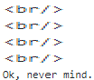

When you remember your name is not actually Dan:
 
 

 
 
 
 
Ok, never mind.
 
 
So basically, I use MD (or Markdown) to build this page. I'm still learning it, because it's a bit hard for somebody who used HTML for **most of all codes**. I actually use HTML code to the line-breaks...
 

 
 
Well, I guess this website will get more pages soon. Meanwhile, I only made this...
